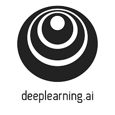
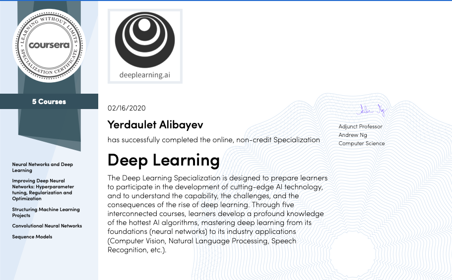

# Deep Learning Specialisation
[Coursera](https://www.coursera.org/specializations/deep-learning?)

 

[summary](https://github.com/yerdaulet1991/Deep-learning-specialization/blob/master/andrew_ng.pdf)

This specialisation has five courses. 

**Courses:**
- **Course 1: Neural Networks and Deep Learning**
- **Learning Objectives** :
   1. Understand the major technology trends driving Deep Learning
   2. Be able to build, train and apply fully connected deep neural networks
   3. Know how to implement efficient (vectorized) neural networks 
   4. Understand the key parameters in a neural network's architecture
- **Programming Assignments**

  1. [Week 2 - Programming Assignment 1 - Logistic Regression with a Neural Network mindset](https://github.com/Gurupradeep/deeplearning.ai-Assignments/blob/master/Neural-networks-Deep-learning/Week2/Logistic%2BRegression%2Bwith%2Ba%2BNeural%2BNetwork%2Bmindset%2Bv4.ipynb)
  2. [Week 3 - Programming Assignment 2 - Planar data classification with one hidden layer](https://github.com/Gurupradeep/deeplearning.ai-Assignments/blob/master/Neural-networks-Deep-learning/Week3/Planar%2Bdata%2Bclassification%2Bwith%2Bone%2Bhidden%2Blayer%2Bv4.ipynb)
  3. [Week 4 - Programming Assignment 3 - Building your Deep Neural Network: Step by Step](https://github.com/Gurupradeep/deeplearning.ai-Assignments/blob/master/Neural-networks-Deep-learning/Week4/Building%2Byour%2BDeep%2BNeural%2BNetwork%2B-%2BStep%2Bby%2BStep%2Bv5.ipynb)
  4. [Week 4 - Programming Assignment 4 - Deep Neural Network for Image Classification: Application](https://github.com/Gurupradeep/deeplearning.ai-Assignments/blob/master/Neural-networks-Deep-learning/Week4/Deep%2BNeural%2BNetwork%2B-%2BApplication%2Bv3.ipynb)

- **Course 2: Improving Deep Neural Networks: Hyperparameter tuning, Regularization and Optimization**
- **Learning Objectives** :
   1. Understand industry best-practices for building deep learning applications. 
   2. Be able to effectively use the common neural network "tricks", including initialization, L2 and dropout regularization, Batch           normalization, gradient checking, 
   3. Be able to implement and apply a variety of optimization algorithms, such as mini-batch gradient descent, Momentum, RMSprop and         Adam, and check for their convergence. 
   4. Understand new best-practices for the deep learning era of how to set up train/dev/test sets and analyze bias/variance
   5. Be able to implement a neural network in TensorFlow. 
   
- **Programming Assignments**
  1. [Week 1 - Programming Assignment 1 - Initialization](https://github.com/Gurupradeep/deeplearning.ai-Assignments/blob/master/Improving%20Deep%20Neural%20Networks/Week1/Initialization.ipynb)
  2. [Week 1 - Programming Assignment 2 - Regularization](https://github.com/Gurupradeep/deeplearning.ai-Assignments/blob/master/Improving%20Deep%20Neural%20Networks/Week1/Regularization.ipynb)
  3. [Week 1 - Programming Assignment 3 - Gradient Checking](https://github.com/Gurupradeep/deeplearning.ai-Assignments/blob/master/Improving%20Deep%20Neural%20Networks/Week1/Gradient%2BChecking%2Bv1.ipynb)
  4. [Week 2 - Programming Assignment 4 - Optimization Methods](https://github.com/Gurupradeep/deeplearning.ai-Assignments/blob/master/Improving%20Deep%20Neural%20Networks/Week2/Optimization%2Bmethods.ipynb)
  5. [Week 3 - Programming Assignment 5 - TensorFlow Tutorial](https://github.com/Gurupradeep/deeplearning.ai-Assignments/blob/master/Improving%20Deep%20Neural%20Networks/Week3/Tensorflow%2BTutorial.ipynb)
  
- **Course 3: Structuring Machine Learning Projects**
- **Learning Objectives** :
   1. Understand how to diagnose errors in a machine learning system, and 
   2. Be able to prioritize the most promising directions for reducing error  
   3. Understand complex ML settings, such as mismatched training/test sets, and comparing to and/or surpassing human-level performance
   4. Know how to apply end-to-end learning, transfer learning, and multi-task learning
   
- **This course doesn't have any programming assignments**

- **Course 4: Convolutional Neural Networks**
- **Learning Objectives** :
   1. Understand how to build a convolutional neural network, including recent variations such as residual networks.
   2. Know how to apply convolutional networks to visual detection and recognition tasks.
   3. Know to use neural style transfer to generate art.
   4. Be able to apply these algorithms to a variety of image, video, and other 2D or 3D data.
- **Programming Assignments**
  1. [Week 1 - Programming Assignment 1 - Convolution model Step by Step](https://github.com/Gurupradeep/deeplearning.ai-Assignments/blob/master/Convolutional_Neural_Networks/Week1/Convolution%2Bmodel%2B-%2BStep%2Bby%2BStep%2B-%2Bv2.ipynb)
  2. [Week 1 - Programming Assignment 2 - Convolution model Application](https://github.com/Gurupradeep/deeplearning.ai-Assignments/blob/master/Convolutional_Neural_Networks/Week1/Convolution%2Bmodel%2B-%2BApplication%2B-%2Bv1.ipynb)
  3. [Week 2 - Programming Assignment 3 - Keras Tutorial Happy House](https://github.com/Gurupradeep/deeplearning.ai-Assignments/blob/master/Convolutional_Neural_Networks/Week2/Keras%2B-%2BTutorial%2B-%2BHappy%2BHouse%2Bv2.ipynb)
  4. [Week 2 - Programming Assignment 4 - Residual Networks](https://github.com/Gurupradeep/deeplearning.ai-Assignments/blob/master/Convolutional_Neural_Networks/Week2/Residual%2BNetworks%2B-%2Bv2.ipynb)
  5. [Week 3 - Programming Assignment 5 - Autonomous driving application - Car Detection](https://github.com/Gurupradeep/deeplearning.ai-Assignments/blob/master/Convolutional_Neural_Networks/Week3/Autonomous%2Bdriving%2Bapplication%2B-%2BCar%2Bdetection%2B-%2Bv1.ipynb)
  6. [Week 4 - Programming Assignment 6 - Face Recognition for Happy House](https://github.com/Gurupradeep/deeplearning.ai-Assignments/blob/master/Convolutional_Neural_Networks/Week4/Face%2BRecognition%2Bfor%2Bthe%2BHappy%2BHouse%2B-%2Bv3.ipynb)
  7. [Week 4 - Programming Assignment 7 - Art Generation with Neural Style transfer](https://github.com/Gurupradeep/deeplearning.ai-Assignments/blob/master/Convolutional_Neural_Networks/Week4/Art%2BGeneration%2Bwith%2BNeural%2BStyle%2BTransfer%2B-%2Bv2.ipynb)
 
- **Course 5: Sequence Models**
- **Learning Objectives** :
   1. Understand how to build and train Recurrent Neural Networks (RNNs), and commonly-used variants such as GRUs and LSTMs.
   2. Be able to apply sequence models to natural language problems, including text synthesis. 
   3. Be able to apply sequence models to audio applications, including speech recognition and music synthesis.
- **Programming Assignments**
   1. [Week1 - Programming Assignment 1 - Building a Recurrent Neural Network](https://github.com/Gurupradeep/deeplearning.ai-Assignments/blob/master/Sequence%20Models/Week1/Building%2Ba%2BRecurrent%2BNeural%2BNetwork%2B-%2BStep%2Bby%2BStep%2B-%2Bv3.ipynb)
   2. [Week1 - Programming Assignment 2 - Character level Dinosaur Name generation](https://github.com/Gurupradeep/deeplearning.ai-Assignments/blob/master/Sequence%20Models/Week1/Dinosaurus%2BIsland%2B--%2BCharacter%2Blevel%2Blanguage%2Bmodel%2Bfinal%2B-%2Bv3.ipynb)
   3. [Week1 - Programming Assignment 3 - Music Generation](https://github.com/Gurupradeep/deeplearning.ai-Assignments/tree/master/Sequence%20Models/Week1/Music%20Generation)
   4. [Week2 - Programming Assignment 1 - Operations on Word vectors](https://github.com/Gurupradeep/deeplearning.ai-Assignments/blob/master/Sequence%20Models/Week2/Operations%2Bon%2Bword%2Bvectors%2B-%2Bv2.ipynb)
   5. [Week2 - Programming Assignment 2 - Emojify](https://github.com/Gurupradeep/deeplearning.ai-Assignments/blob/master/Sequence%20Models/Week2/Emojify%2B-%2Bv2.ipynb)
   6. [Week3 - Programming Assignment 1 - Neural Machine translation with attention](https://github.com/Gurupradeep/deeplearning.ai-Assignments/blob/master/Sequence%20Models/Week3/Neural%2Bmachine%2Btranslation%2Bwith%2Battention%2B-%2Bv3.ipynb)
   7. [Week3 - Programming Assignment 2 - Trigger word detection](https://github.com/Gurupradeep/deeplearning.ai-Assignments/blob/master/Sequence%20Models/Week3/Trigger%2Bword%2Bdetection%2B-%2Bv1.ipynb)
  
 
   
 

  
